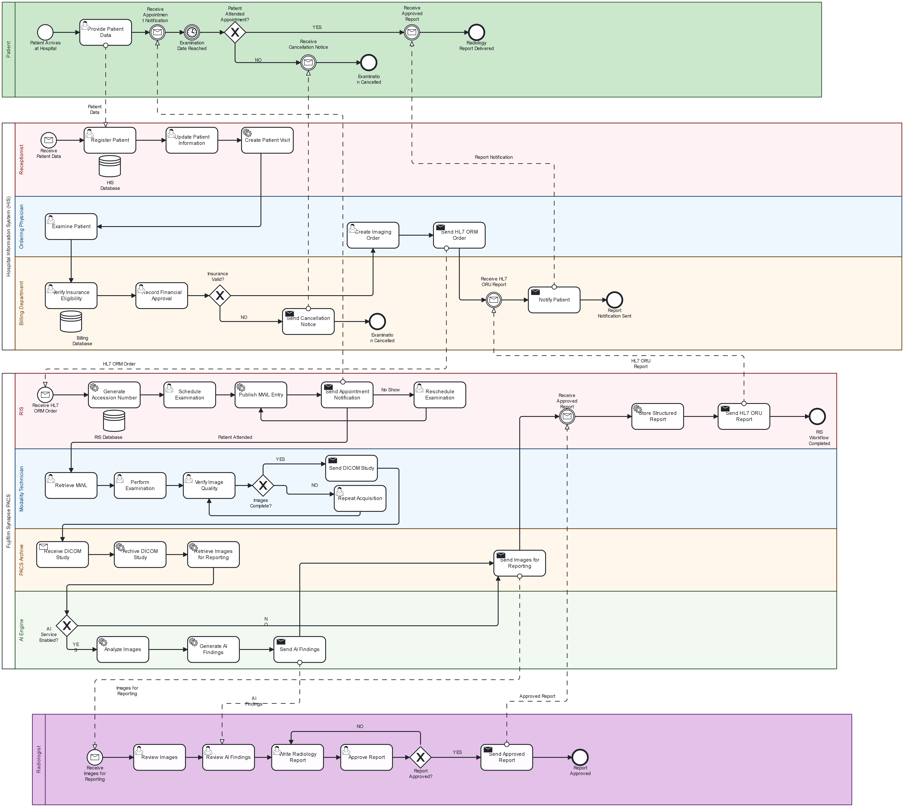

# AI-Enabled Radiology Workflow using BPMN 2.0

## Overview

This repository presents a **BPMN 2.0 workflow model** for an AI-enabled radiology process, demonstrating the integration of healthcare information systems and imaging standards throughout the patient's diagnostic journey.

The workflow illustrates how different systems communicate and collaborate to support efficient radiology operations, from patient registration to final report delivery.

---

  

## System Components

🏥 **Hospital Information System (HIS)**

🖥️ **Radiology Information System (RIS)**

📦 **Picture Archiving and Communication System (PACS)**

🤖 **AI Engine**

👨‍⚕️ **Radiologists**

📷 **Modality Technologists**

---

## Workflow Overview

The workflow follows the patient's journey through the radiology department:

1. Patient Registration

2. Imaging Order Creation

3. HL7 ORM Order Transmission

4. Examination Scheduling

5. Modality Worklist Retrieval

6. Image Acquisition

7. DICOM Study Archiving

8. AI-assisted Image Analysis

9. Radiologist Interpretation

10. Structured Report Validation

11. HL7 ORU Result Transmission

12. Report Delivery to HIS

---

## Key Concepts Demonstrated

* HL7 ORM Imaging Orders

* HL7 ORU Result Messages

* DICOM Image Acquisition and Storage

* Modality Worklist (MWL)

* AI-generated Findings

* Structured Radiology Reporting

* Healthcare Interoperability

* BPMN 2.0 Process Modeling

* Accession Number as the Central Workflow Identifier

---

## Repository Contents

| File                                | Description            |
| ----------------------------------- | ---------------------- |
| intelligent-radiology-workflow.bpmn | BPMN 2.0 source file   |
| workflow_snapshot.png               | Workflow visualization |
| README.md                           | Project documentation  |

---

## Future Enhancements

* FHIR Integration

* Critical Findings Notification

* Voice Recognition Reporting

* AI-based Triage Workflow

* Peer Review Process

* Multi-site PACS Deployment Scenario

---

## Standards and Technologies

* BPMN 2.0

* HL7 v2.x

* DICOM

* RIS/PACS Integration

* AI-assisted Radiology

* Healthcare Interoperability

---

### Author

**Marwan Ayman**

Junior Healthcare IT Engineer

Interested in PACS, DICOM, HL7, Healthcare Interoperability, and AI-powered Radiology Solutions.
